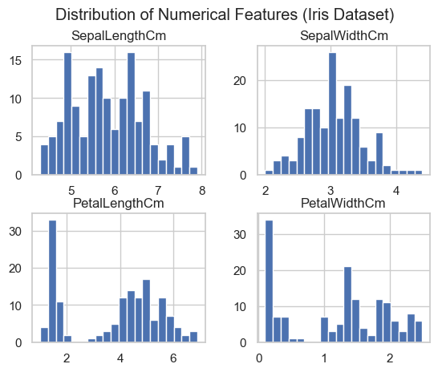
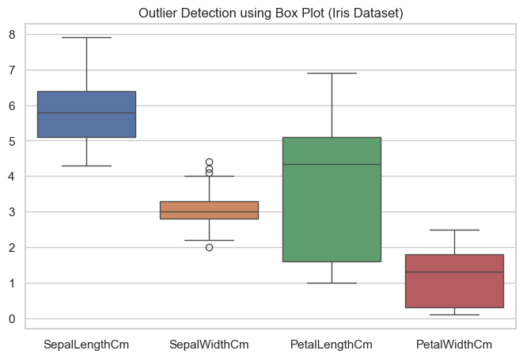
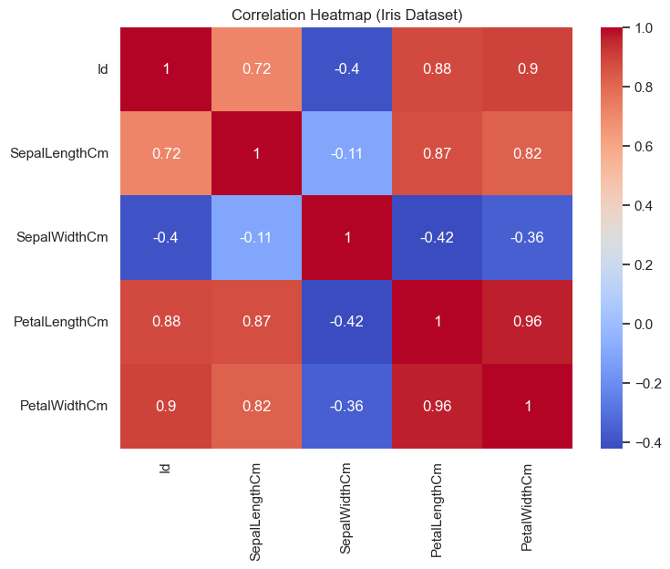
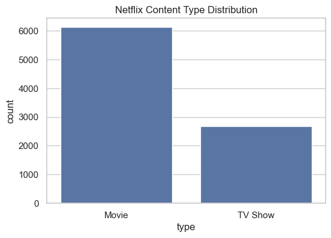

# Visual Insights Report — Task 3

## Iris Dataset

### Numerical Feature Distribution

- Petal features show clear separation.
- Useful for species classification.

---

### Outlier Detection

- Minor outliers in sepal width.
- No extreme anomalies.

---

### Correlation Analysis

- Strong correlation between petal length and width.
- Indicates multicollinearity.

---

## Netflix Dataset

### Content Type Distribution

- Movies dominate over TV shows.
- Platform is movie-heavy.
